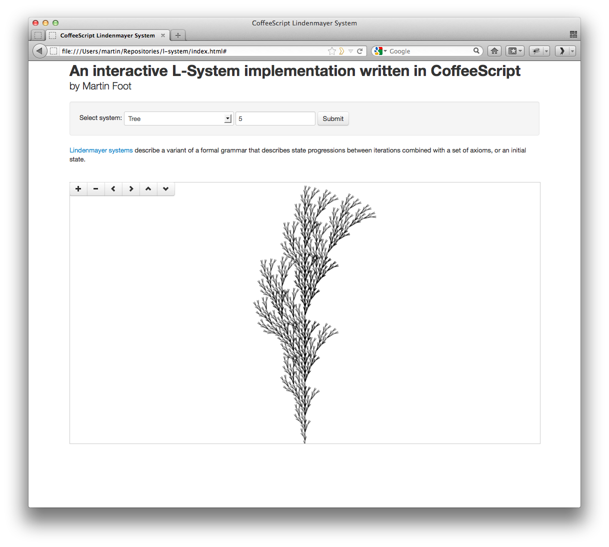

CoffeeScript Lindenmayer System Renderer
========================================

This project contains a basic [CoffeeScript](http://coffeescript.org/) renderer
for [L-systems](http://en.wikipedia.org/wiki/L-system). It can be compiled into
JavaScript and then rendered in the browser using an HTML Canvas element.

A `Makefile` is provided that will run the CoffeeScript compiler to generate
the `lsystem.js` file required by the browser.

Usage:

    cd /path/to/repository
    make
    firefox index.html

